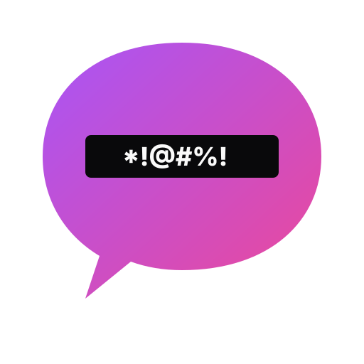
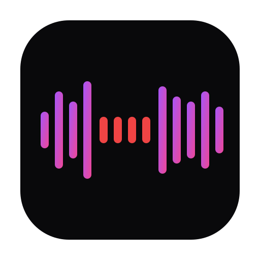
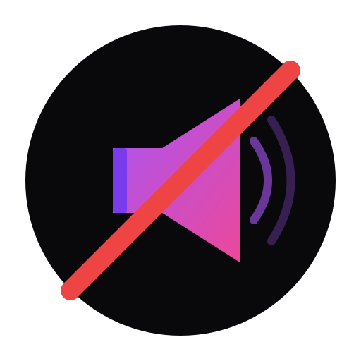
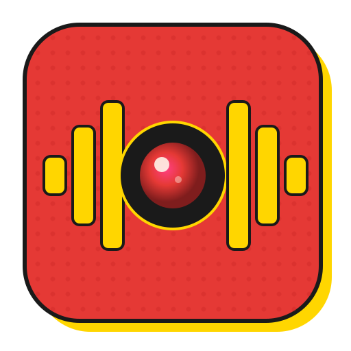
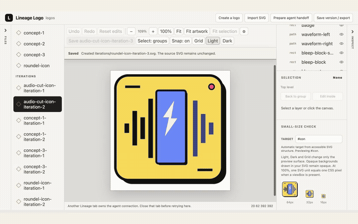

# Logo Designer Skill

A plugin for your agent for iterative logo design using SVG. Guides you through a structured interview, exploration, and refinement process to produce polished logos exported as PNGs.

## Installation

Clone once, then launch Claude Code / Codex with the plugin loaded for that session:

```bash
git clone https://github.com/neonwatty/logo-designer-skill.git
claude --plugin-dir ./logo-designer-skill
```

## Usage

The skill activates automatically when you ask your agent to design a logo. Try prompts like:

- "Create a logo for my project"
- "Make me a logo"

## Workflow

The skill walks you through four phases:

1. **Interview** -- Claude asks about your brand, audience, and aesthetic preferences.
2. **Explore** -- Generates 3-5 distinct SVG concepts displayed in a side-by-side preview.
3. **Refine** -- Iterate on your chosen direction with adjustments to color, layout, and detail.
4. **Export** -- Renders final PNGs at standard sizes: 16, 32, 48, 192, 512, 1024, and 2048 px.

## PNG Export Prerequisites

The export step requires one of the following SVG-to-PNG tools. The skill auto-detects which is available.

| Tool | Install command |
|------|----------------|
| **resvg** (recommended) | `npm install -g @aspect-build/resvg` |
| Inkscape | `brew install inkscape` |
| librsvg | `brew install librsvg` |

## Example

I regularly use this skill to design and iterate on logos for my own apps - some examples for [one such app](https://bleepthat.sh) are shown below.

| Concept 1 | Concept 2 | Concept 3 | Finished design |
| :---: | :---: | :---: | :---: |
|  |  |  |  |

Some more thoughts behind designing and iterating using the skill can be [found here](https://neonwatty.com/posts/foil-icon-design-claude-code/).

## Landed on a logo you like?  Fine-tune the small details with a shared canvas

After landing on a design with this skill, I fine tune small details using this visual canvas I created that lets you and your agent manually adjust shape, size, color, and spacing together - without constantly regenerating the whole logo.

[**Fine-tune your logo in Lineage Logo →**](https://github.com/lineagehq/lineage-logo)

[](https://neonwatty.github.io/logo-designer-skill/#polish)

## License

MIT
